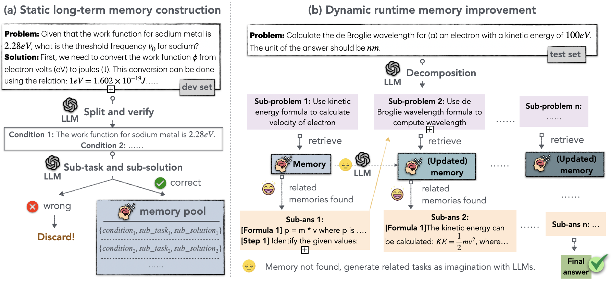

# ChemAgent: Self-updating Memories in Large Language Models Improves Chemical Reasoning
## Table of Contents

- [Overview](#overview)
- [Key Features](#key-features)
- [Project Structure](#project-structure)
- [Getting Started](#getting-started)
- [How to run](#how-to-run)
- [How to dev](#how-to-dev)

## Overview

ChemAgent leverages an innovative self-improving memory system to significantly enhance performance in complex scientific tasks, with a particular focus on Chemistry.



## Key Features

- **Self-updating Memory System**: Continuously improves model performance
- **Specialized for Chemistry**: Tailored for chemical reasoning tasks
- **Modular Architecture**: Includes task splitting, execution, association, and reflection modules

## Project Structure

- `Xagent/agent/`: Contains prompts and code for functional modules
- `dev_test.py`: Execution code for memory pool construction
- `assets/config.yml`: Configuration and module activation management
- `output/`: Experimental results for GPT-4 and GPT-3.5 across four datasets
- `memory/`: Plan Memory and Execute Memory for the four datasets
- `dataset/`: Experimental datasets from [SciBench](https://github.com/mandyyyyii/scibench)

## Getting Started

1. **Installation**: (Add installation instructions here)
2. **Configuration**: Modify `assets/config.yml` to suit your needs
3. **Running Experiments**: Use `dev_test.py` with appropriate parameters

For detailed usage instructions, see the "How to run" and "How to dev" sections below.

## How to run

#### Run on dataset

```
python dev_test.py --tool python --mode test --list_source <put_the_datasetname_here>
```

You can choose from the following datasets located in the `dataset` folder: `atkins`, `chemmc`, `matter`, or `quan`.

## How to dev

Before executing tasks using this framework, it is necessary to first construct memory according to the process outlined in the paper. 

1. **Add Few-shot Examples:**
   In the `XAgent/agent/simple_agent/prompt.py` file, select two examples from `fewshot_examples` and incorporate them into the model prompt. 

2. **Update Configuration File:**
   Modify the `assets/config.yml` file to adjust the configuration according to your requirements. 

3. **Run Development Tests:**
   Execute the development test mode using the following command:
   ```bash
   python dev_test.py --tool python --mode dev --list_source <put_the_datasetname_here>

## Configuration

The `assets/config.yml` file allows you to customize various settings for the ChemAgent framework:

### Model Settings

```yaml
default_completion_kwargs:
  model: gpt-3.5-turbo-16k
  eva_model: gpt-4
  temperature: 0.2
  request_timeout: 60
```

To change other settings:

```yaml
save_dir: "./memory/exec_memory/storage_matter_gpt4"
plan_save_dir: "./memory/plan_memory/plan_storage_matter_gpt4"
score: False
refine: False
image: False
```

The configuration parameters control various aspects of the system:

1. Memory Pools:
   - `plan_save_dir`: Specifies the memory pool for Plan Memory
   - `save_dir`: Specifies the memory pool for Execution Memory

2. Knowledge Memory:
   - `img`: Controls the activation of Knowledge Memory

3. Task Execution:
   - `refine`: Determines if the system should refine the task strategy upon execution failure

4. Evaluation:
   - `score`: Decides if the evaluation module is enabled

